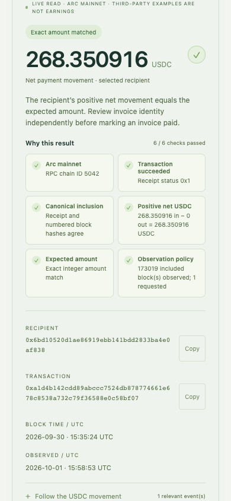

# Arc Receipt

An independent, read-only Arc mainnet USDC movement verifier. Enter a public transaction hash and recipient, optionally set an exact expected amount, then inspect six checks and export readable HTML plus raw JSON evidence. Reimport JSON to recompute saved claims and query the fixed official RPC again.

Arc emits 18-decimal native system logs and 6-decimal ERC-20 logs for the same ERC-20 movement. We match those movements and count only the canonical system stream. Native-only sends work too. Gas and incoming mints are excluded; outgoing burns and forwarding reduce the recipient's transaction-local net. All amount arithmetic is integer based.

No wallet, signature, custody, account, database, analytics or verification gas. The examples are existing third-party public transactions, not builder transactions or user earnings. A successful receipt can have zero net payment.

## Run

Node.js 22+: `npm start`, then http://127.0.0.1:4313. `npm test` runs 45 recorded-evidence/import/transport tests without network access. `npm run verify -- --recheck evidence/browser-live-receipt.json` makes fresh public RPC reads.

For browser QA: `npm ci --ignore-scripts --no-audit --no-fund`, set `CHROME_PATH` to an installed Chrome executable, then `npm run qa`. The QA uses a temporary headless profile; 23 checks distinguish genuine public RPC cases from injected faults. It does not attach to existing browser accounts.

## Demo

Click Exact receipt for 268.350916 USDC and six checks. Open Follow the USDC movement to see one canonical movement and an excluded ERC-20 duplicate. Download HTML/JSON, then reimport the JSON for a fresh check. Click Received, then forwarded: successful execution, 1458.033036 USDC in and out, zero net receipt.

## Reviewable interface and evidence

Rechecked October 1, 2026 against the official public RPC. The 23 browser checks separate actual mainnet reads from replayed/injected abnormal responses; only four read methods were observed, with no browser errors or write requests. The 45 verifier/import/transport tests also passed after the refreshed observations. These checks verify the prototype's behavior, not grant eligibility or a production certification.

Desktop: exact observed receipt, six explainable checks

Real counterexample: successful execution, zero net receipt

Mobile: receipt details at 390 pixels

Screenshots are from a local interface querying real mainnet data, not a hosted website. Public example addresses and amounts are not the builder's funds, user earnings or project revenue. Reproduce the positive case with `npm run verify -- --recheck evidence/browser-live-receipt.json`; use `evidence/mainnet-roundtrip.json` for the zero-net case. CLI exit 2 for zero-net is an expected review conclusion, not a transport failure.

## Prepare a static deployment

Python 3: `python3 scripts/prepare-publication.py` produces audited, deterministic source and Pages asset ZIPs in `release/`. `node scripts/deploy-pages.mjs --project YOUR_PROJECT` prints a pinned CLI command only. See `DEPLOYMENT.md` for user-controlled publishing after authorization.

## Trust limits

Unsigned RPC observation, not validator signatures or a cryptographic inclusion proof. Single-provider trust; no invoice identity, ownership or cross-invoice reuse ledger. Matching an amount does not itself authorize shipment. Arc settles committed blocks deterministically; extra observed blocks are optional business policy, not additional consensus finality. No grant eligibility, award, adoption or revenue is claimed.

## License

MIT. See [LICENSE](LICENSE). Copyright (c) 2026 sundaysebasidian-byte.

Public source: https://github.com/sundaysebasidian-byte/arc-receipt. Public hosting and organizer confirmation of read-only grant eligibility remain pending.

Sources: [Arc system events](https://docs.arc.io/arc/references/usdc-system-events), [Arc deterministic finality](https://docs.arc.io/arc/concepts/deterministic-finality).
