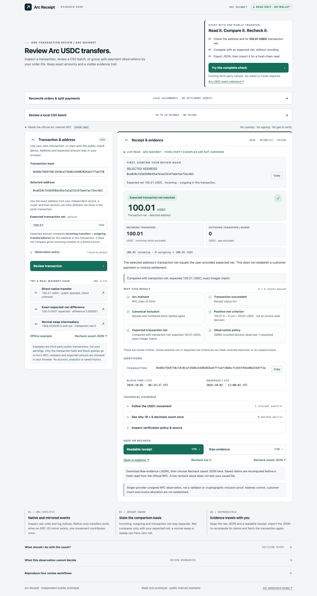
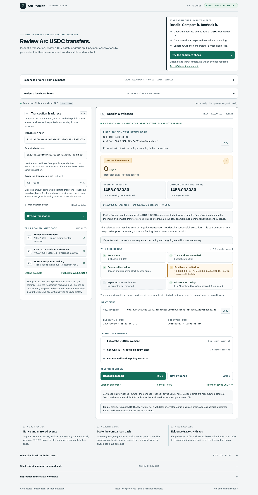

# Arc Receipt

[Open the demo](https://sundaysebasidian-byte.github.io/arc-receipt/) · [Public source](https://github.com/sundaysebasidian-byte/arc-receipt) · MIT

A read-only Arc USDC transaction review and local CSV order-review prototype. Choose a public transaction and an address, inspect **incoming transfers, outgoing transfers/burns and transaction net** separately, optionally compare an expected transaction net, then export readable HTML plus raw JSON for later recomputation and fresh recheck.

In the single-transaction review, expected amount compares with **incoming transfers minus outgoing transfers/burns in this transaction**, not gross receipts, a whole invoice or State balance change. Incoming mints, self/zero movements and gas are excluded. Expected net is positive-only; leave it blank when reviewing zero or outgoing-only flows. A match does not establish address control, customer intent, invoice allocation or settlement. The single-transaction view and its exports do not aggregate other transactions. The separate order review sums user-assigned transaction-net observations; it does not prove commercial settlement. Sweep policies require independent context.

Official Explorer already decodes and de-duplicates Arc movements correctly and offers State changes. This prototype focuses a selected address and packages its review basis with recomputable evidence; no Explorer defect or proven user time saving is claimed. See [single cases and Explorer comparison](docs/workflow-comparison.md).

## Orders and partial observations

Open **Reconcile orders & split payments**. Import `order_id,order_total_usdc,tx_hash,address` (up to20 payment records /100000 UTF-8 bytes), preview assignments, then review. Nonempty records are counted before known-column projection; extra-only malformed rows remain visible and in the evidence bundle. Distinct transaction nets are summed with exact18-decimal integers. Repeat the same order total on each row; the total counts once. Repeated order/hash/address input counts once. A valid hash participates in allocation checks even if the address or another field is invalid. A hash assigned across different orders or addresses is blocked before RPC; output splitting is unsupported. Missing, invalid, cancelled or ambiguous records withhold the complete-order comparison while preserving observed net so far.

**Load illustrative split order** uses made-up `DEMO-` order labels over two unrelated third-party public transactions:100.01 +1458.033036 =1558.043036 USDC. A repeated row counts once; an explicitly unknown hash stays incomplete. **Load allocation-conflict demo** blocks the shared hash while a separate order verifies. These are illustrative arithmetic assignments, not real customer bills or user earnings. Export comparisons/exceptions and a raw evidence bundle; open a payment for individual HTML/JSON export and fresh recheck. [Format and trust boundaries](docs/order-review.md).

## Local CSV batch

Open **Review a local CSV batch**: import up to20 records with `tx_hash,address,expected_net_usdc`, preview validation/repeated-input warnings, then review sequentially. Exact expected-net comparisons, per-row errors and cancellation remain visible; export the exception list and open individual receipts for HTML/JSON handoff and saved-file recheck. No customer-data upload or backend. See [format, statuses and actual public example](docs/batch-review.md), [sample CSV](evidence/public-batch-example.csv) and [actual batch screenshot](evidence/desktop-batch.png).

## Reproduce

Node.js22+: `npm start`, then http://127.0.0.1:4313. No wallet, signature, custody, account, database, analytics or verification gas. Only transaction-hash and block queries go from this interface to the fixed official RPC; address and expected amount are evaluated locally.

Start with **Try the complete check** on the first screen. Confirm the full address and expected net above the amount, then export JSON and choose **Recheck saved JSON** beside the exports. Changing an input clears the previous observation. Ordinary **Recheck live** does not test a saved file.

1. **Direct native transfer:** a third-party public native send shows100.01 incoming,0 outgoing and100.01 net. Expected net matches; owner and purpose remain unknown.
2. **Exact expected-net difference:** the same transaction with expected net100.010001 shows an exact0.000001 difference, without declaring an invoice unpaid.
3. **Normal swap intermediary:** TakerPositionManager in a cirBTC→USDC swap shows1458.033036 incoming/outgoing, net0, expectation blank. Inspect paired18/6 logs; normal routing is technical context, not merchant nonpayment evidence.
4. **Evidence handoff:** download HTML/JSON from the direct case, then import JSON. Saved claims are recomputed before fresh fixed-RPC queries; supplied endpoints and presentation claims are not trusted.

All amounts and addresses are existing third-party examples, not user earnings, builder transactions, known merchant receipts or grant proceeds.

## Verification and evidence

`npm test`: **105 offline unit tests**, including27 order cases and19 batch cases and8 scope cases for exact net differences, intermediary/final-receiver distinction, mints, sweeps, negative flow and untrusted imported invoice claims. Historical paired-stream data is a named arithmetic fixture, not the current direct example.

With an installed Chrome, `npm ci --ignore-scripts --no-audit --no-fund`, then set `CHROME_PATH` if needed:

- `npm run qa`: **30 browser checks**, separating genuine public RPC cases from explicitly injected/replayed abnormal responses.
- `npm run qa:ui`: **21 local UI checks**, explicit replay/synthetic fixtures for keyboard, selected contrast, five widths,13 mobile action sizes, reduced motion and isolated copy. Not fresh-chain evidence or full accessibility certification.
- `node scripts/external-order-regression.mjs`:26 independent-reviewer offline checks, adapted only for local input/output paths; not an external retest.
- `node scripts/order-qa.mjs`: **12 checks**,16 actual public reads for illustrative order aggregation, per-payment fresh recheck and allocation conflicts; labelled cancellation/file cases.
- `node scripts/audit-order-bundle.mjs`: recompute exported receipts and independently decode/sum canonical system-event raw units; saved unsigned evidence only.
- `node scripts/boundary-regression.mjs`: exact independent-review100000-byte fixture,4 actual public reads.
- `node scripts/receipt-render-qa.mjs`: current HTML export at320/390/768/1440px, full identifiers, no scripts/external requests.
- `node scripts/batch-qa.mjs`: actual five-record batch and individual exported-receipt recheck, then explicitly labelled local cancellation/HTTP429/file cases.
- `node scripts/workflow-qa.mjs`: **4 genuine workflows**,20 actual public read requests, no RPC fixtures or user-study claims.
- `node scripts/explorer-review.mjs`: official Explorer Details/Token transfers/State/Logs inspection, with recorded navigation and screenshots.

The core `web/verifier.mjs` is byte-identical to the reviewed baseline; import-recompute/fresh-recheck function bodies remain byte-identical. Presentation, readable HTML and examples intentionally changed. See `evidence/core-preservation.json`. `evidence/order-boundary-delivery-validation.json` records the current boundary-fix candidate. Historical counts and captures do not prove this revision. The reviewed source baseline is `efb49dd369c29562b9882d3b039556d536129909`; deployment changes are limited to static hosting paths, metadata and publication documentation.

## Actual local interface

Screenshots are local UI with fresh mainnet reads, not a hosted website. [Reviewer path](docs/reviewer-guide.md), [usefulness hypothesis](docs/user-validation-plan.md) and [publication decisions](docs/release-approval.md) distinguish implementation from unvalidated usefulness and pending qualification.

## Package and deployment

GitHub Pages serves the static `docs/` folder from this repository's `main` branch. Run `node scripts/build-github-pages.mjs` to reproduce the site. Modules and CSS are copied without modification from `web/`; relative resource links support the `/arc-receipt/` project path. No backend, analytics, database, wallet, paid domain or verification gas is required. See [deployment instructions](DEPLOYMENT.md).

The original `prepare-publication.py` and Cloudflare dry-run helper remain available for alternative offline candidates. They do not deploy GitHub Pages. No private development history or application material is included in this public update. Existing public history and the original MIT [license](LICENSE) are retained.

## Trust and qualification limits

Single-provider unsigned RPC observation, not validator signatures or cryptographic inclusion proof. No invoice identity, ownership, intent, reuse ledger or automatic shipment decision. Mints can increase balance while being excluded; gas makes explicit-transfer net differ from State delta. Arc commits deterministically; extra observed blocks are optional business policy.

The [official program](https://community.arc.io/public/events/arc-microgrants-f8tijfjhyq) requires a working mainnet deployment and public link. Its accessible FAQ does not settle the hosted read-only/no-custom-contract interpretation. Hosting alone is not acceptance. No award, seven-day decision/payout, income, adoption or probability is claimed. [Qualification and publication decisions](docs/release-approval.md).

Primary references: [USDC system events](https://docs.arc.io/arc/references/usdc-system-events), [deterministic finality](https://docs.arc.io/arc/concepts/deterministic-finality).
